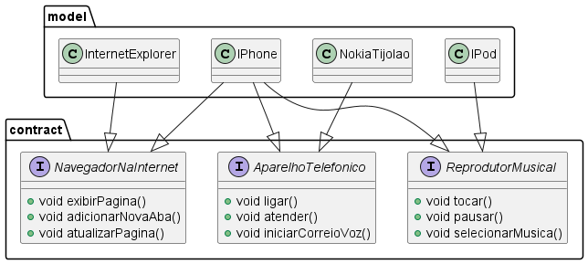

# Atvidade Diagramação de Classes IPhone📱

Atividade para treinamento de criação de UML e *interface java* baseado no vídeo de lançamento do primeiro iphone [https://youtu.be/taTmpYQ_3jk](https://youtu.be/taTmpYQ_3jk)

**UML:**
